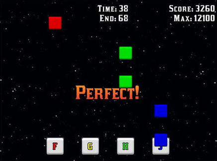

# Game: Rhythm Tapper

The player presses a sequence of keys indicated by falling objects overlapping targets, all of which is synchronized with music playing in the background.

## Setup

- **Java** 8
- **Gradle** Wrapper 6.7.1
- **LigGDX** 1.9.12: https://libgdx.badlogicgames.com
- Setup tool: https://github.com/tommyettinger/gdx-liftoff

## Disclaimer

This game is the result of reading, studying and learning the examples shown in the book "**Java Game Development with LibGDX**" by the author Lee Stemkoski.

- **Book site**: https://www.apress.com/gp/book/9781484233238
- **Source-code**: https://github.com/Apress/java-game-dev-LibGDX
